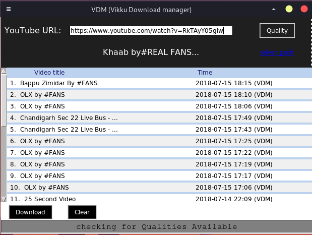
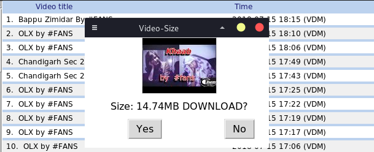
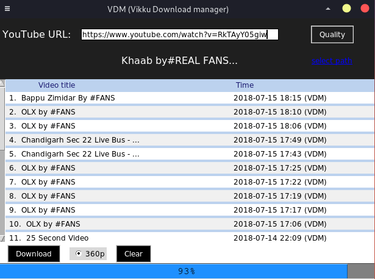

# Youtube Downloader  
it is Tkinter based application.
I use pytube to download youtube videos and integrate it with tkinter.
I am still updating it to make it better.  
for more datails about pytube you can look for https://github.com/nficano/pytube
or pytube documentation http://python-pytube.readthedocs.io/en/latest/index.html  
## History of downloaded videos  
  
## Video Size is also mentioned.  
  
## During Downloading  
  

Thankyou.  
